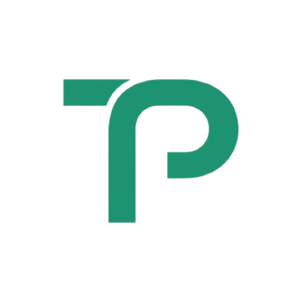
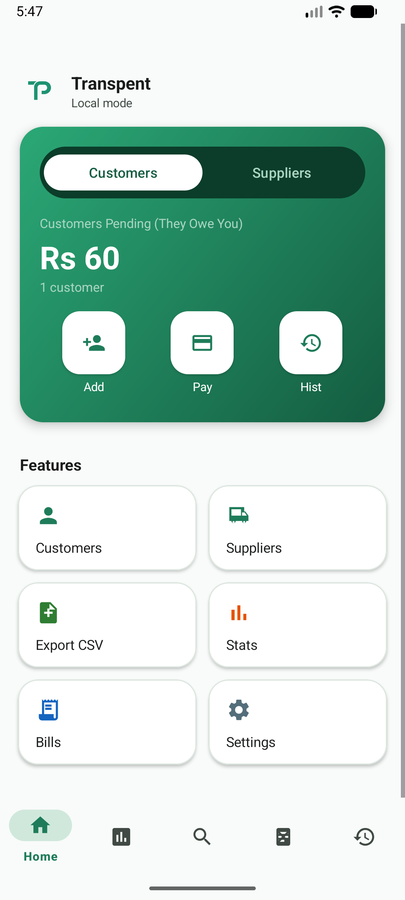
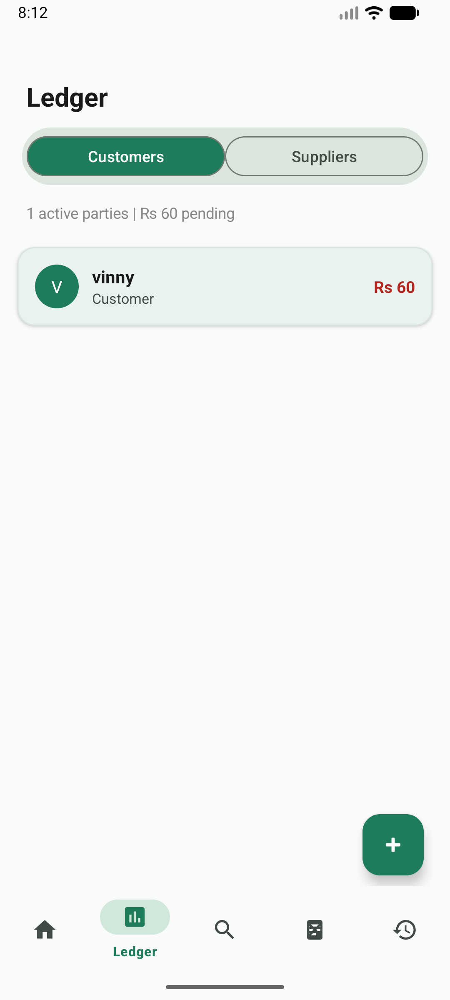
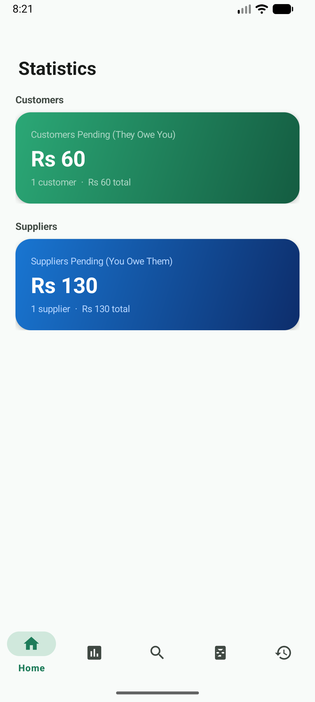

<p align="center">
  
</p>

<h1 align="center">Transpent</h1>

<p align="center">
  <strong>Offline-first ledger app for small businesses</strong><br/>
  Track what customers owe you. Track what you owe suppliers. Zero cloud dependency.
</p>

<p align="center">
  
  
  
  
  
</p>

---

## 📱 Screenshots

<p align="center">
  
  
  
  
</p>

---

## ✨ Features

- **📊 Context-Aware Dashboard** — Decoupled home section card with an intuitive pill switcher. Real-time outstanding balances for Customers (Emerald Green) and Suppliers (Sapphire Blue).
- **👥 Customers Ledger** — Add customers, log items they bought (with quantity & price), record full or partial payments, attach bill photos
- **🚚 Suppliers Ledger** — Track what you owe suppliers with the same complete entry system
- **📈 Statistics** — Real computed breakdown of customers due vs suppliers due represented in matching theme-colored dashboard cards
- **📄 Export CSV** — Export your full ledger as a single CSV or separate files per party, shareable instantly
- **☁️ Drive Backup** *(optional)* — Backup and restore the entire ledger to Google Drive when signed in
- **🔒 Offline First** — All data stored locally on-device via JSON. No internet required for any core feature
- **🎨 Material Design 3** — Full MD3 implementation with contextual brand palettes (Emerald Green `#145C41` & Sapphire Blue `#0D2D6B`), smooth card transitions, and dynamic action menus

---

## 🗂️ Project Structure

```
app/src/main/
├── java/com/transpent/app/
│   └── MainActivity.java       # Single-activity architecture (1 file, fully self-contained)
├── res/
│   ├── drawable/
│   │   ├── logo_nav.png        # Top bar logo
│   │   ├── logo_wordmark.png   # Export screen wordmark
│   │   ├── ic_nav_*.xml        # Bottom navigation vector icons
│   │   ├── ic_action_*.xml     # Quick action row icons
│   │   └── ic_feat_*.xml       # Feature grid icons
│   └── values/
│       └── styles.xml          # MD3 green theme tokens
```

---

## 🏗️ Tech Stack

| Layer | Technology |
|---|---|
| Language | Java |
| UI Toolkit | Material Components for Android (MDC 1.12) |
| Design System | Material Design 3 |
| Data Persistence | Local JSON file (`ledger.json` in `filesDir`) |
| Min SDK | 26 (Android 8.0) |
| Target SDK | 34 (Android 14) |

---

## 🚀 Getting Started

### Prerequisites
- Android Studio Hedgehog or later
- JDK 17+
- Android SDK 34

### Clone & Run
```bash
git clone https://github.com/vinamrapandey/Transpent.git
cd Transpent
```

Open in **Android Studio**, let Gradle sync, then hit **Run ▶**.

No API keys, no Firebase setup, no environment variables needed. It just works.

---

## 📦 Download

Head to the [**Releases**](https://github.com/vinamrapandey/Transpent/releases) page to download the latest APK and install it directly on your Android device.

> **Enable "Install from unknown sources"** in Settings → Security before installing a sideloaded APK.

---

## 📋 Data Model

```
LedgerStore
├── customers[]  →  Party { name, phone, items[], miscPaid, billUris[] }
├── suppliers[]  →  Party { name, phone, items[], miscPaid, billUris[] }
└── products[]   →  Product { name, price }

Party.items[]    →  Entry { name, qty, price, paid, date }
```

All data is serialized to JSON and stored in the app's private `filesDir`. No external storage permission required.

---

## 🗺️ Roadmap

- [x] Customer & supplier ledger
- [x] Item-level and misc payment recording
- [x] Bill photo attachment (camera + gallery)
- [x] CSV export (single & split)
- [x] Google Drive backup/restore
- [x] Material Design 3 rebrand (Transpent Green)
- [x] Proper bottom nav icons
- [x] Statistics with real data
- [x] FAB add button on ledger screens
- [ ] Search / filter customers & suppliers
- [ ] Date range filter on history
- [ ] Multi-currency support
- [ ] Google Play Store release
- [ ] Widget for pending balance

---

## 🤝 Contributing

Pull requests are welcome! For major changes, open an issue first to discuss what you'd like to change.

1. Fork the repo
2. Create a feature branch: `git checkout -b feat/your-feature`
3. Commit your changes: `git commit -m "feat: add your feature"`
4. Push and open a PR

---

## 📄 License

MIT License — see [LICENSE](LICENSE) for details.

---

<p align="center">
  Built with ❤️ for small businesses in India
</p>
